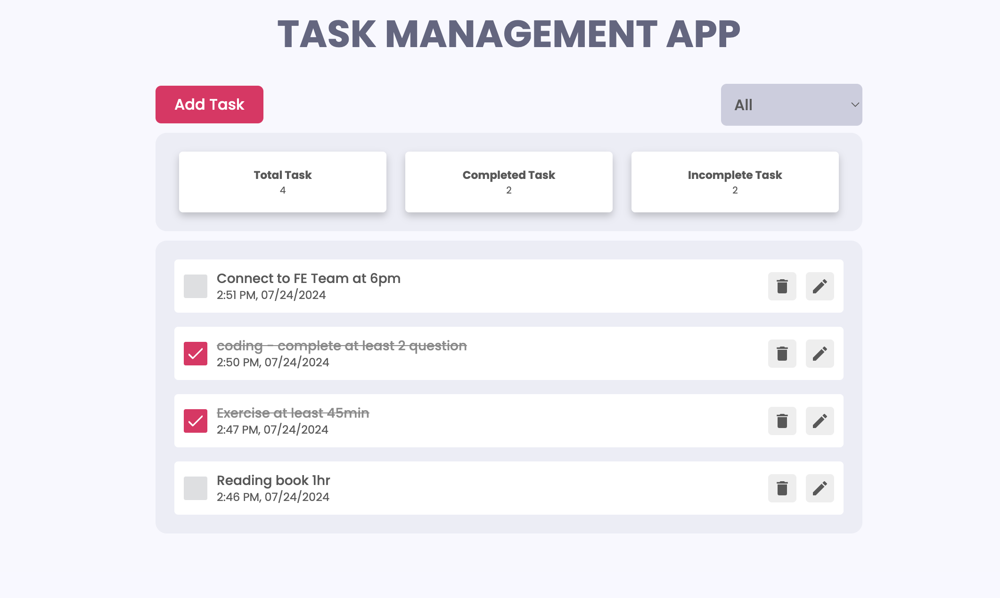

# Task Management App.

**live demo: [https://wc-react-task-app.netlify.app/](https://wc-react-task-app.netlify.app/)**

---

## Project Description

In the project, we will be creating a Complete Task Management Application with all features. We will do all the CRUD operations and Dashboard including the total number of tasks, completed
tasks, and pending tasks. We will use `React.js` and to manage our states, we will use `Redux-toolkit` and for UNIT test case `React Testing Library/JEST`

## Used Tech

- [React](https://reactjs.org/)
- [React Redux-toolkit](https://redux-toolkit.js.org/)
- [React Testing Library](https://testing-library.com/docs/react-testing-library/intro/)
- [Jest](https://jestjs.io/)
- [Sass](https://sass-lang.com/)
- [Framer Motion](https://framer.com/motion/)
- [React icons](https://react-icons.netlify.com/)
- [React Hot Toast](https://react-hot-toast.com/)

## How to run
clone this project or download zip and go in main directory

```shell
npm install or npm i (for install node_modules)
```

and after that start the dev server.

```shell
npm start
```
and for test cases

```shell
npm test
```

# Task_Management_app
